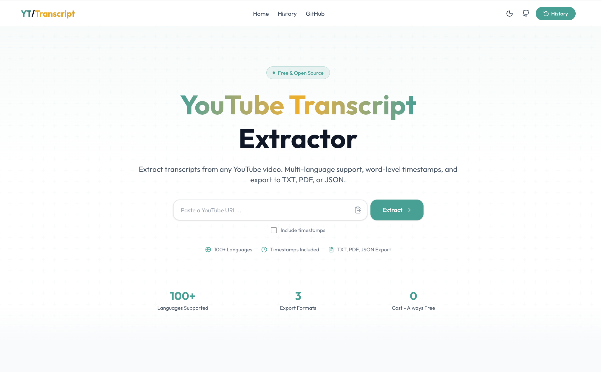
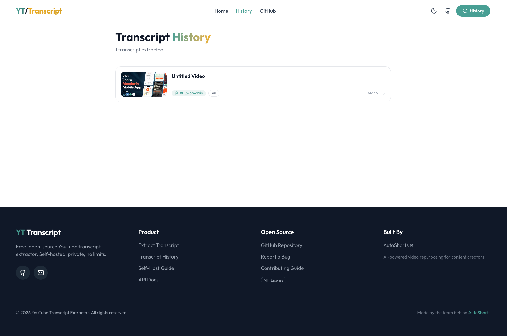
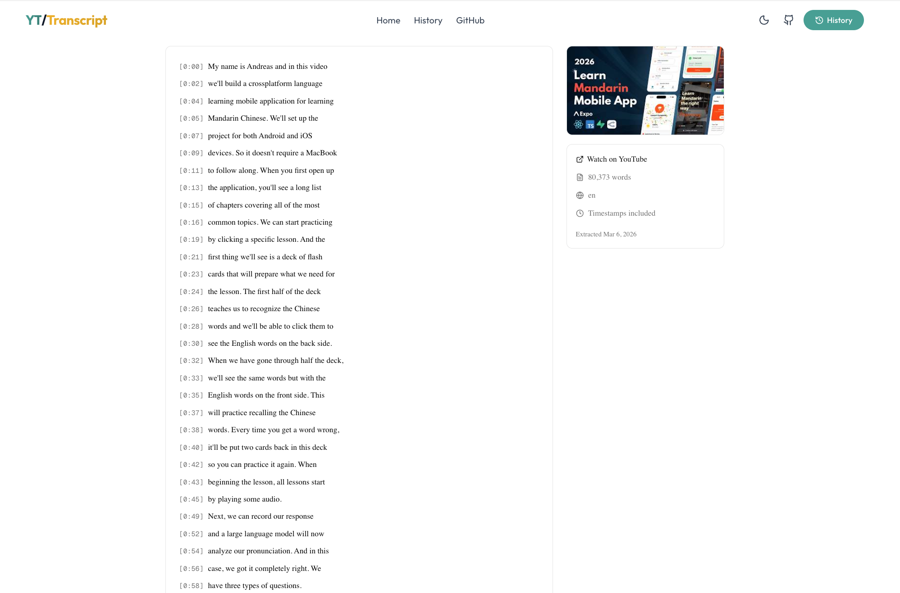

# YouTube Transcript Extractor

> Free, open-source YouTube transcript extractor with multi-language support, timestamps, and export to TXT, PDF, JSON. Self-hosted with Docker.

[](https://github.com/nicolaigaina/youtube-transcript-extractor/actions/workflows/ci.yml)
[](https://opensource.org/licenses/MIT)
[](https://www.docker.com/)
[](CONTRIBUTING.md)

[Features](#features) | [Quick Start](#quick-start) | [API Docs](docs/API.md) | [Contributing](CONTRIBUTING.md)

## Screenshots

| Landing Page | Transcript History | Transcript Viewer |
|:---:|:---:|:---:|
|  |  |  |

## Features

- **Multi-Language Support** -- Automatically detects and extracts transcripts in 100+ languages
- **Instant Language Switching** -- Switch between available languages without re-fetching
- **Word-Level Timestamps** -- Optional segment-level timing data synced to video
- **Export Formats** -- Download as TXT, PDF, or JSON
- **Full-Text Search** -- Search within transcripts with match highlighting and navigation
- **Transcript History** -- All extracted transcripts saved locally with deduplication
- **Dark Mode** -- Full dark/light theme support
- **Self-Hosted** -- Run on your own infrastructure, your data stays private
- **Docker Ready** -- One command to launch with Docker Compose
- **Optional Proxy** -- Oxylabs residential proxy support to bypass YouTube bot detection

## Why a Proxy?

YouTube aggressively blocks automated transcript requests. When you run this tool from a server or make many requests, YouTube will detect the non-browser traffic pattern and start returning errors like:

- `TranscriptsDisabled` for videos that clearly have captions
- HTTP 429 (Too Many Requests)
- IP-based rate limiting and temporary bans

**Why residential proxies specifically?** YouTube distinguishes between datacenter IPs (AWS, GCP, etc.) and residential IPs (real ISPs like Comcast, Vodafone). Datacenter proxies get blocked almost immediately. Residential proxies route your requests through real consumer IP addresses, making them indistinguishable from a person watching YouTube at home.

**Oxylabs Residential Proxy** is what we use and recommend:

1. Sign up at [oxylabs.io](https://oxylabs.io/products/residential-proxy-pool)
2. Choose the **Residential Proxy** product (not datacenter or ISP)
3. You'll get a username and password for proxy authentication
4. Add them to your `.env` file:

```bash
OXYLABS_RESIDENTIAL_USERNAME=customer-your_username
OXYLABS_RESIDENTIAL_PASSWORD=your_password
```

**Without a proxy**, the app connects directly to YouTube. This works fine for:
- Local development and testing
- Low-volume personal use (a few transcripts per day)
- Networks where YouTube doesn't flag your IP

**With a proxy**, you get:
- Reliable extraction even at high volume
- No IP bans or rate limiting
- Consistent results from any hosting environment (AWS, Railway, Fly.io, etc.)

> **Cost:** Oxylabs residential proxies are pay-per-GB. Transcript extraction uses very little bandwidth (text only), so costs are minimal -- typically under $1/month for moderate usage.

## Quick Start

### Option 1: Docker Compose (Recommended)

```bash
git clone https://github.com/nicolaigaina/youtube-transcript-extractor.git
cd youtube-transcript-extractor
docker compose up
```

Open [http://localhost:3000](http://localhost:3000)

### Option 2: Local Development

**Prerequisites:** Node.js 20+, Python 3.12+

```bash
# Clone
git clone https://github.com/nicolaigaina/youtube-transcript-extractor.git
cd youtube-transcript-extractor

# Backend
cd backend
pip install -r requirements.txt
python app.py

# Frontend (new terminal)
cd frontend
npm install
cp ../.env.example .env
npx prisma db push
npm run dev
```

### Option 3: Make

```bash
make setup  # Install dependencies
make dev    # Start both servers
```

## Architecture

```
┌─────────────────────┐     ┌─────────────────────┐
│                     │     │                     │
│   Next.js Frontend  │────>│  Flask Backend API  │
│   (Port 3000)       │     │  (Port 5000)        │
│                     │     │                     │
│  - Server Actions   │     │  - /api/transcript  │
│  - Prisma (SQLite)  │     │  - /api/health      │
│  - shadcn/ui        │     │  - youtube-transcript│
│  - Dark Mode        │     │    -api + Proxy      │
│                     │     │                     │
└─────────────────────┘     └─────────────────────┘
         │
         v
   ┌───────────┐
   │  SQLite   │
   │  Database │
   └───────────┘
```

**Frontend:** Next.js 15 with App Router, Tailwind CSS, shadcn/ui components. Server Actions serve as the middle tier between the UI and backend API. Prisma with SQLite for zero-config persistence.

**Backend:** Python Flask API using `youtube-transcript-api` library. Supports optional Oxylabs residential proxy for reliability at scale.

## Configuration

| Variable | Default | Description |
|----------|---------|-------------|
| `BACKEND_URL` | `http://localhost:5000` | Backend API URL |
| `FRONTEND_URL` | `http://localhost:3000` | Frontend URL (for CORS) |
| `DATABASE_URL` | `file:./data/transcripts.db` | SQLite database path |
| `OXYLABS_RESIDENTIAL_USERNAME` | -- | Optional: Oxylabs residential proxy username ([sign up](https://oxylabs.io/products/residential-proxy-pool)) |
| `OXYLABS_RESIDENTIAL_PASSWORD` | -- | Optional: Oxylabs residential proxy password |

## API Documentation

See [docs/API.md](docs/API.md) for full backend API documentation.

## Tech Stack

| Layer | Technology |
|-------|-----------|
| Frontend | Next.js 15, TypeScript, Tailwind CSS, shadcn/ui |
| Backend | Python, Flask, youtube-transcript-api |
| Database | SQLite (via Prisma) |
| Deployment | Docker, Docker Compose |

## Contributing

Contributions are welcome! Please read our [Contributing Guide](CONTRIBUTING.md) for details on how to submit pull requests, report bugs, and suggest features.

## License

This project is licensed under the MIT License -- see the [LICENSE](LICENSE) file for details.

---

<p align="center">
  Built by the team behind <a href="https://autoshorts.app"><strong>AutoShorts</strong></a> -- AI-powered video repurposing for content creators.
</p>
